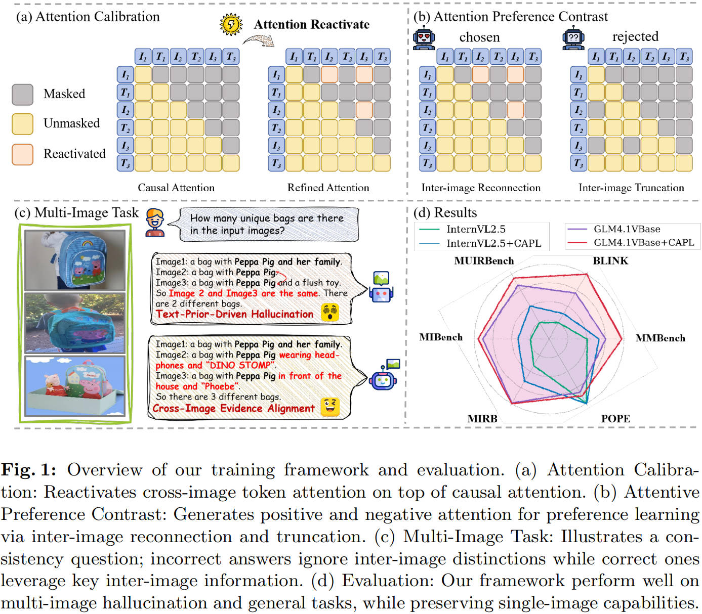
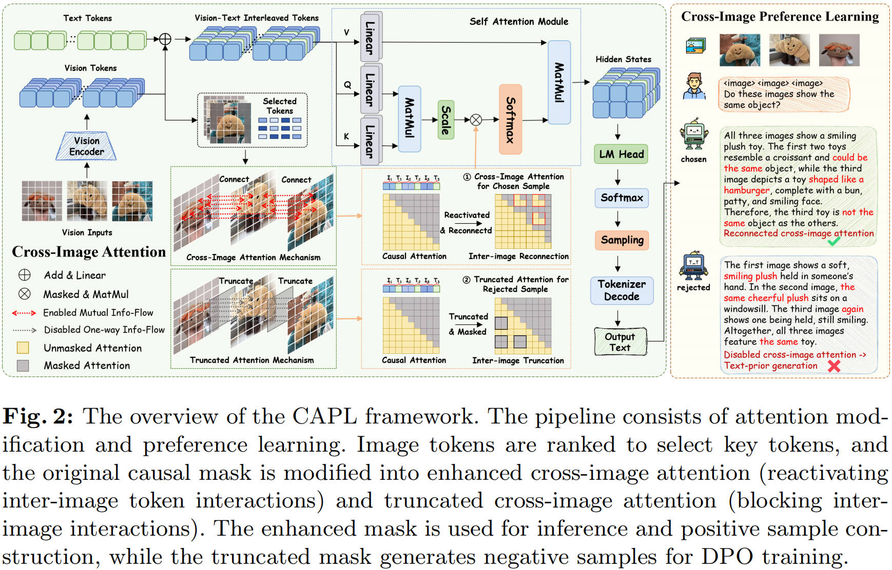

# Looking Back and Forth: Cross-Image Attention Calibration and Attentive Preference Learning for Multi-Image Hallucination Mitigation

Xiaochen Yang* · Hao Fang* · Jiawei Kong · Yaoxin Mao · Bin Chen# · Shu-Tao Xia

<div style='display:flex; gap: 0.25rem; '>
<a href='https://arxiv.org/abs/2603.07048'></a>
</div>

## Accepted By ECCV 2026!


 Although large vision-language models (LVLMs) have demonstrated remarkable capabilities, they are prone to hallucinations in multi-image tasks. We attribute this issue to limitations in existing attention mechanisms and insufficient cross-image modeling. 
 
 Inspired by this, we propose a structured hallucination mitigation framework involving **C**ross-Image **A**ttention calibration and **P**reference **L**earning **(CAPL)**. CAPL explicitly enhances inter-image interactions at the architectural level while reinforcing reliance on genuine cross-image evidence during training, thereby improving the model’s perception and modeling of cross-image associations. Specifically, we (i) introduce a selectable image token interaction attention mechanism to establish fine-grained cross-image entity alignment and information flow; (ii) design a cross-image modeling–based preference optimization strategy that contrasts reasoning outcomes under full inter-image interaction and those obtained when images are mutually invisible, encouraging the model to ground its predictions in authentic visual evidence and mitigating erroneous inferences driven by textual priors. Experimental results demonstrate that CAPL consistently improves performance across multiple model architectures, achieving stable gains on both multi-image hallucination and general benchmarks. Notably, performance on single-image visual tasks remains stable or slightly improves, indicating strong generalization capability.

<p align="center">
  
</p>

## 💡 Highlights
- We analyze the structural causes of hallucination in multi-image reasoning, identifying imbalanced visual information flow and insufficient cross-image semantic association as key factors that limit multi-image reasoning performance.

- We propose a novel framework, CAPL, which integrates selective cross-image attention with preference alignment training, enhancing semantic interaction among critical cross-image tokens and reinforcing the model to better perceive and utilize inter-image interactions.

- Extensive experiments demonstrate that our method generalizes well across multiple recent vision-language models, significantly reducing hallucination and improving reasoning performance on multi-image tasks.


## 💎 CAPL Framework

<p align="center">
  
</p>

Our CAPL consists of two components:


### 1. Selective Cross-Image Token Interaction

We remove the unidirectional constraint of normal causal attention to enable **bidirectional cross-image interaction**, while preserving intra-image causality.

```math
M^{cross}_{ij} =
\begin{cases}
0, & g(i) \neq g(j) \\
M^{causal}_{ij}, & g(i) = g(j)
\end{cases}
```

To reduce noise, we select key visual tokens based on feature magnitude and apply **selective cross-image attention**.  
Final attention is a fusion of causal and cross-image attention, with alternating layers for stability.

### 2. Cross-Image Attention Guided DPO

We further optimize the model using **preference learning**.

- Positive samples: generated with cross-image attention  
- Negative samples: generated using truncated cross-image attention (blocks inter-image interaction)

```math
M^{trunc}_{ij} =
\begin{cases}
M^{causal}_{ij}, & g(i) = g(j) \\
-\infty, & g(i) \neq g(j)
\end{cases}
```

We apply **DPO loss** to encourage correct cross-image reasoning and suppress hallucinations, combined with an auxiliary NLL loss for training stability.


## 🛠️ Usage

### Cross-Attn & Trunc-Attn Implementation

We provide modified modeling files for multiple LVLMs (GLM-4.1V, InternVL2.5 and Qwen2.5VL).

- Files **without `_trunc` suffix** implement **cross-image attention (proposed method)**.
- Files **with `_trunc` suffix** implement **truncated attention (baseline for negative sample construction)**.

These modifications are applied consistently across all supported model architectures.

### Training & Evaluation

- **Training**
  - GLM / Qwen: [LLaMA-Factory](https://github.com/hiyouga/LLaMA-Factory)
  - InternVL: [ms-swift](https://github.com/modelscope/ms-swift)

- **Evaluation**
  - Use [VLMEvalKit](https://github.com/open-compass/VLMEvalKit) for all benchmarks


## ✒️ Citation
```bibtex
@article{yang2026looking,
  title={Looking Back and Forth: Cross-Image Attention Calibration and Attentive Preference Learning for Multi-Image Hallucination Mitigation},
  author={Yang, Xiaochen and Fang, Hao and Kong, Jiawei and Mao, Yaoxin and Chen, Bin and Xia, Shu-Tao},
  journal={arXiv preprint arXiv:2603.07048},
  year={2026}
}
```
